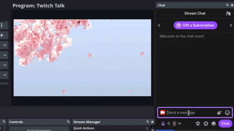
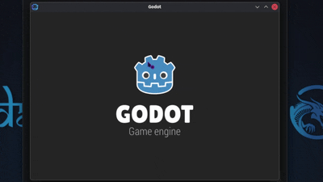
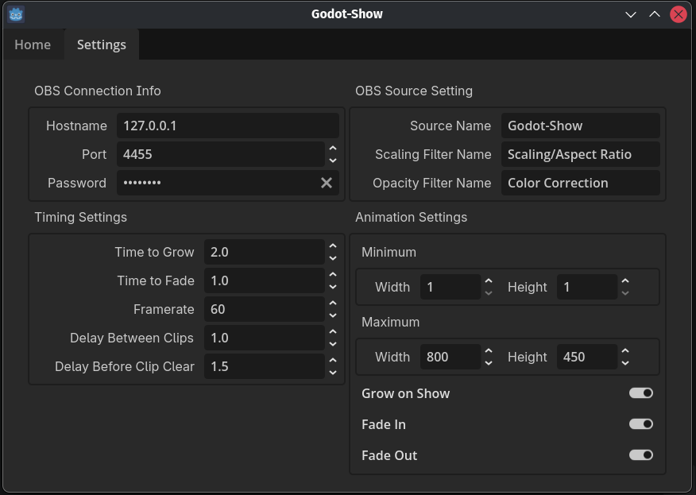

# Godot-Show
Show-off random clips from other streamers when you shout them out

<p align="center" dir="auto">
</img></p>

![GitHub Release](https://img.shields.io/github/v/release/madalee-com/godot-show?include_prereleases&logo=data:image/svg%2bxml;base64,PHN2ZyB4bWxucz0iaHR0cDovL3d3dy53My5vcmcvMjAwMC9zdmciIHZpZXdCb3g9IjAgMCA2NDAgNTEyIj48IS0tIUZvbnQgQXdlc29tZSBGcmVlIHY3LjEuMCBieSBAZm9udGF3ZXNvbWUgLSBodHRwczovL2ZvbnRhd2Vzb21lLmNvbSBMaWNlbnNlIC0gaHR0cHM6Ly9mb250YXdlc29tZS5jb20vbGljZW5zZS9mcmVlIENvcHlyaWdodCAyMDI2IEZvbnRpY29ucywgSW5jLi0tPjxwYXRoIGZpbGw9IiNmNmY1ZjQiIGQ9Ik01NjAuMyAyMzcuMmMxMC40IDExLjggMjguMyAxNC40IDQxLjggNS41IDE0LjctOS44IDE4LjctMjkuNyA4LjktNDQuNGwtNDgtNzJjLTIuOC00LjItNi42LTcuNy0xMS4xLTEwLjJMMzUxLjQgNC43Yy0xOS4zLTEwLjctNDIuOC0xMC43LTYyLjIgMEw4OC44IDExNmMtNS40IDMtOS43IDcuNC0xMi42IDEyLjhMMjcuNyAyMTguN2MtMTIuNiAyMy40LTMuOCA1Mi41IDE5LjYgNjUuMWwzMyAxNy43IDAgNTMuM2MwIDIzIDEyLjQgNDQuMyAzMi40IDU1LjdsMTc2IDk5LjdjMTkuNiAxMS4xIDQzLjUgMTEuMSA2My4xIDBsMTc2LTk5LjdjMjAuMS0xMS40IDMyLjQtMzIuNiAzMi40LTU1LjdsMC0xMTcuNXptLTI0MC05LjhMMTcwLjIgMTQ0IDMyMC4zIDYwLjYgNDcwLjQgMTQ0IDMyMC4zIDIyNy40em0tNDEuNSA1MC4ybC0yMS4zIDQ2LjItMTY1LjgtODguOCAyNS40LTQ3LjIgMTYxLjcgODkuOHoiLz48L3N2Zz4=)


## Features

- **Show clips on shoutouts:** Automatically show a random clip when you use !so
- **User friendly GUI:** Functions and settings are managed through a single simple GUI
- **Cross-platform:** Thanks to being based on Godot, the app is available for most OS
- **Easy Twitch Login:** Unlike other tools, Godot-show has a 1 button connect to Twitch
- **Direct OBS integration:** Godot-show plays the clips in an OBS Media Source



## Quick Start

- Add a Media Source in OBS and name it Godot Show
- Download and run the application
- Press "Connect to Twitch" and Authorize Godot-Show in the browser
- Use !so to send a shoutout and see the clip play in OBS

## Installation

### Prerequisites

- OBS 29+ with some basic knowledge of configuring it
- A Twitch Channel that you are an admin on

### Configure OBS
Godot-Show does it's work by changing the URL of a Media Source in OBS.  It then uses a pair of filters to scale and fade in/out the clip.


1. Add a Media Source in OBS
2. Rename the Media Source to "Godot-Show". This name can be configured later, so pick any unique name you want.
3. Configure the Media Source how you want. We recommend uncheckng "Show nothing when playback ends"
4. Add a "Scaling/Aspect Ratio" Effects Filter to the source. You can rename this if you want, and configure the name in the application later. This is only required if you want the video to grow/scale in to the scene.
5. Add a "Color Correction" Effects Filter to the source. You can rename this if you want, and configure the name in the application later. This is only required if you want the video to fade in/out when showing and hiding.
6. If the WebSocket server isn't enabled, you need to enable it now.
    1. Go to Tools->WebSocket Server Settings
    2. Make sure "Enable WebSocket server" is enabled.
    3. Take note of the Server Port(change it if you want, it defaults to 4455)
    4. Enable Authentication(technically optional)
    5. Set a Server Password(technically optional)
    6. You can click "Show Connect Info" to see the Server IP/Port/Password if needed
    7. Click Ok

### Installing Godot-Show
Just download the release for your OS, and run

### Initial Godot-Show configuration
The first time you start Godot-Show you'll need to connect it to Twitch.  You can click the "Connect on Startup" option to have the application auto-connect in the furture.



1. Click "Connect to Twitch"
2. A browser window/tab will open asking if you authorize Godot-Show to do it's stuff, click Authorize
3. If your OBS Websocket is set to the defaults, Godot-Show should automatically connect.  You should see the message "Connection to OBS established"
4. If OBS isn't set to the defaults, visit the Settings tab to configure it.  Once properly configured, Godot-Show will auomatically connect.
5. If the messages "Connection to OBS established" and "Connected to Twitch" both show in the log window, then you are ready to use Godot-Show

## Additional Settings

### OBS Connection Info
| Settings | Default | Description |
|--------|---------|-------------|
| `Hostname` | 127.0.0.1 | IP Address of OBS WebSocket Server |
| `Port` | 4455 | Port of OBS WebSocket Server |
| `Password` | password | Password of OBS WebSocket Server.  Leave blank if none. |
### OBS Source Settings
| Settings | Default | Description |
|--------|---------|-------------|
| `Source Name` | Godot-Show | The name of the Media Source you added in OBS |
| `Scaling Filter Name` | Scaling/Aspect Ratio | The name of the Scaling/Aspect Ratio filter |
| `Opacity Filter Name` | Color Correction | The name of the Color Correction filter |
### Timing Settings
| Settings | Default | Description |
|--------|---------|-------------|
| `Time to Grow` | 2.0 | Time the video should take to Grow/Scale to full size |
| `Time to Fade` | 1.0 | Time the video should take to fade in/out |
| `Framerate` | 60 | How often to refresh the animations |
| `Delay Between Clips` | 1.0 | How long to wait till playing the next clip in queue |
| `Delay Before Clip Clear` | 1.5 | How long to wait before clearing the clip from the screen.  If using Fade Out, set this longer than the Time to Fade |
## Animation Settings
| Settings | Default | Description |
|--------|---------|-------------|
| `Minimum Width/Height` | 1x1 | The initial size of the clip when Growings/Scaling in |
| `Maximum Width/Height` | 800x450 | The max/full size of the clip when Growings/Scaling in |
| `Grow on Show` | Enabled | If enabled, the clip with grow/scale up to full size as it's shown |
| `Fade In` | Enabled | If enabled, the clip will Fade In when being shown |
| `Fade Out` | Enabled | If enabled, the clip will Fade Out at the end |

## Some Notes

#### How Pronounce?
Go-doh-show

#### Why Godot?
It works on everything, development is fully self contained between Godot and the source code, and it makes sense to use something that understands frame pacing when doing animations.

## Roadmap
```
- [x] Release the initial version
- [ ] Add a "hey you want me to setup OBS for you?" dialog
- [ ] Add more animation options, such as "inflate" mode
- [ ] Have people tell us it doesn't work
```

## Building/Compiling
1. Clone the repo `git clone https://github.com/madalee-com/godot-show`
2. Download and run [Godot 4.6](https://godotengine.org/) or newer
3. Open the project.godot file
4. Click Project->Export (You need the latest Export Templates for Godot, available on the Export page)

## Contributing

We welcome contributions! Open an issue or a PR.

**Quick contribution guide:**

1. Fork the repo
2. Create feature branch (`git checkout -b feature/amazing-feature`)
3. Commit changes (`git commit -m 'Add amazing feature'`)
4. Push to branch (`git push origin feature/amazing-feature`)
5. Open Pull Request

## Support

- Check [existing issues](./issues)
- Message us on Discord @madalee
- Interact with us on [Twitch](https://www.twitch.tv/madalee_com)
- Open a [new issue](./issues/new)

## License

This project is provided under the GNU General Public License v3.0. See the [LICENSE](./blob/master/LICENSE) file for more information.

## Acknowledgments

- Based on [grow-show](https://github.com/ronaacode/grow-show)
- [Godot 4.6](link) - The application/game framework
- [Twitcher](https://github.com/kanimaru/twitcher) - Provides the GDScript Twitch API
- [OBS Websocket GD](https://github.com/you-win/obs-websocket-gd) - Provides the GDScript OBS API