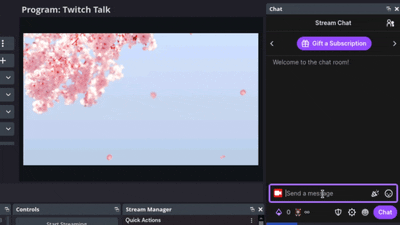
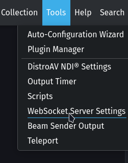
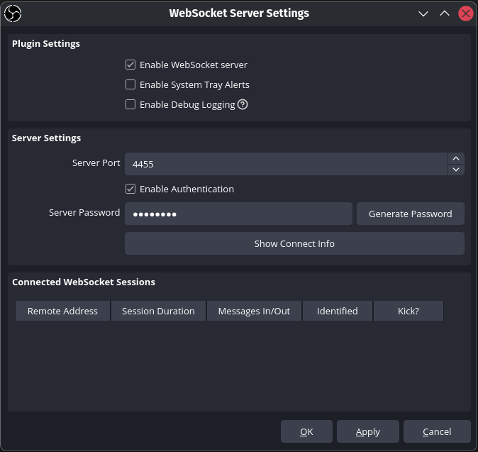
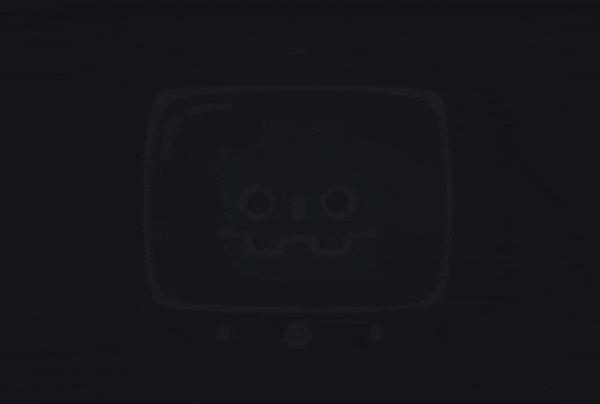
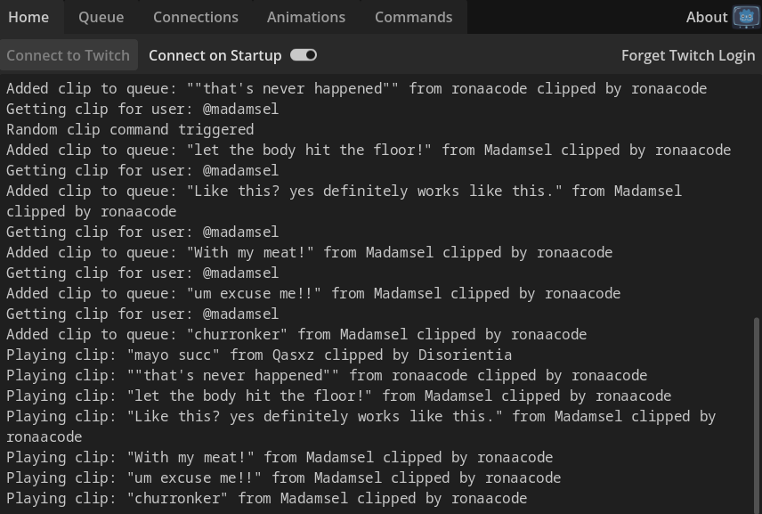
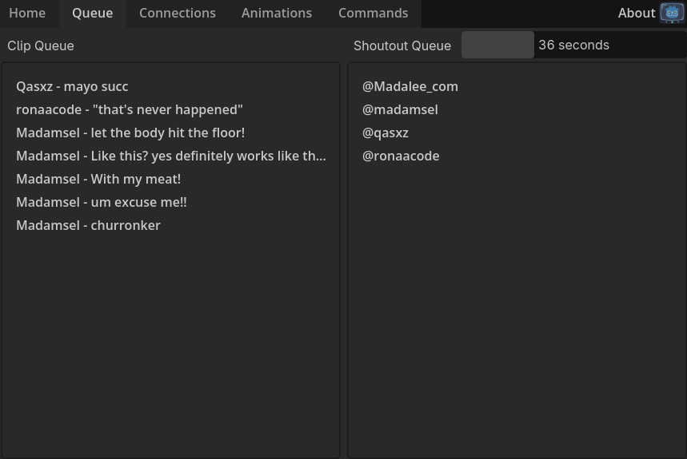
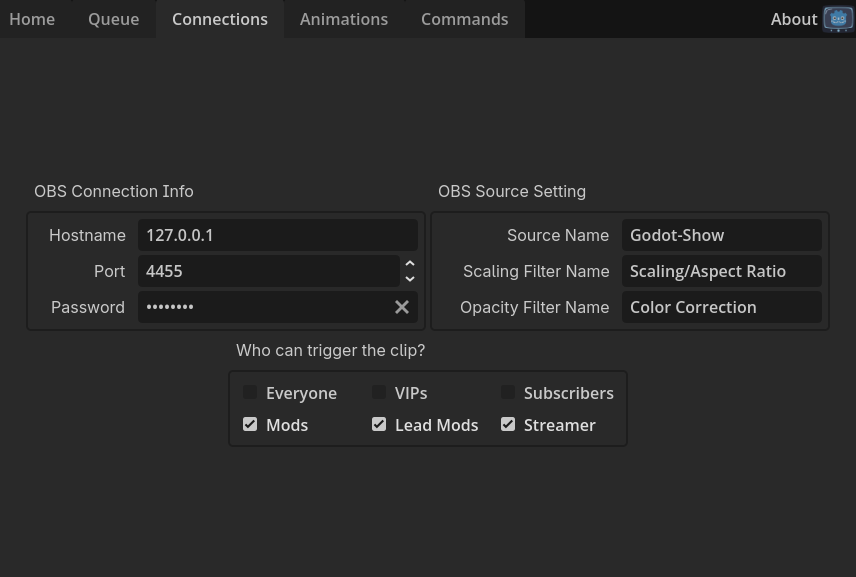
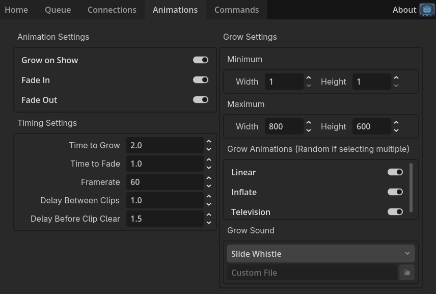
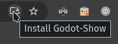
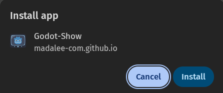

# Godot-Show
Show-off random clips from other streamers when you shout them out

<p align="center" dir="auto">
</img></p>


![GitHub Release](https://img.shields.io/github/v/release/madalee-com/godot-show?include_prereleases&logo=)


## Features

- **Show clips on shoutouts:** Automatically show a random clip when you use !so
- **User friendly GUI:** Functions and settings are managed through a single simple GUI
- **Cross-platform:** Thanks to being based on Godot, the app is available for most OS
- **Easy Twitch Login:** Unlike other tools, Godot-show has a 1 button connect to Twitch
- **Direct OBS integration:** Godot-show plays the clips in an OBS Media Source
- **Queue up shoutouts:** If clips are on cooldown, they will be sent once the cooldown is over
- **Play a clip show:** Continuously play clips from the Streamer or multiple users



## Quick Start

- Enable OBS WebSocket in OBS
- [Download](https://github.com/madalee-com/godot-show/releases) and run the application(or use the [Web Application](#about-the-web-application))
- On the OBS Configuration Needed screen, take note of the Scene that Godot-Show will be added to
- Press "Connect to Twitch" and Authorize Godot-Show in the browser
- In OBS copy/move the Godot-Show source to any scenes you want it in.
- Use !so to send a shoutout and see the clip play in OBS

## Detailed Installation and Setup

### Prerequisites

- OBS 29+ with some basic knowledge of configuring it
- A Twitch Channel that you are an admin on

### Configure OBS
Godot-Show needs to connect to OBS using the WebSocket, so you need to enable that.

#### Enable OBS WebSocket

    1. Go to Tools->WebSocket Server Settings
    2. Make sure "Enable WebSocket server" is enabled.
    3. Take note of the Server Port(change it if you want, it defaults to 4455)
    4. Enable Authentication(technically optional)
    5. Set a Server Password(technically optional)
    6. You can click "Show Connect Info" to see the Server IP/Port/Password if needed
    7. Click Ok





#### Installing Godot-Show
Just [download](releases) the release for your OS, and run or use the [Web Application](#about-the-web-application)<br />
NOTE: The Web Application is also available as an "installable" web app if you are using browser that supports PWA(like Chrome)

#### Initial Godot-Show configuration
The first time you start Godot-Show you'll need to get it connected to OBS and Twitch.

Godot-Show does it's work by changing the URL of a Media Source in OBS.  It then uses a pair of filters to scale and fade in/out the clip.<br />
You can set this up manually, but we recommend you let Godot-Show set it up for you.



#### Connect to OBS
1. If OBS isn't running you will see a popup telling you to enabled the OBS WebSocket.  If you haven't, you should [enable the WebSocket now](#enable-obs-webSocket).
2. If you are using a custom port, address, or password, you will need to configure those by clicking Close button on the popup, then clicking the [Settings](#additional-settings) tab, and configure the WebSocket settings there.
3. Once the connection to OBS is established, if you don't already have the Godot-Show source added to a Scene, or if the source doesn't have the necessary filters, you will see a popup offering to set it up for you.
4. On the OBS Configuration Needed screen, take note of the Scene that Godot-Show will be added to.
4. Either click "Setup OBS for me" or add a the source and filters the dialog shows.
5. In OBS move/copy the Godot-Show source from the scene you noted earlier to any scenes you want it in.
6. If you want to use the Grow Sounds, you should also add an application or output audio capture to OBS.

#### Connect to Twitch
1. Click "Connect to Twitch"
2. A browser window/tab will open asking if you authorize Godot-Show to do it's stuff, click Authorize NOTE: If you are using the WebApp this will provide you with a code to enter in to Twitch, instead.
3. If the messages "Connection to OBS established" and "Connected to Twitch" both show in the log window, then you are ready to use Godot-Show

## Home Tab

| Control | Description |
|---------|-------------|
| `Connect to Twitch` | Press this to get connected to Twitch |
| `Connect on Startup` | Enable this to automatically connect to Twitch on startup |
| `Forget Twitch Login` | If you need to switch accounts, or disconnect this account, click this |
## Queue Tab

| Control | Description |
|---------|-------------|
| `Clip Queue` | Shows the clips that are waiting to be played |
| `Shoutout Queue` | Shows streamers who are queued to be shouted out |
| `Ready for Shoutout/Time Left Bar` | Shows how long till the next shoutout |
## Connections Tab

### OBS Connection Info
| Settings | Default | Description |
|----------|---------|-------------|
| `Hostname` | 127.0.0.1 | IP Address of OBS WebSocket Server |
| `Port` | 4455 | Port of OBS WebSocket Server |
| `Password` | password | Password of OBS WebSocket Server.  Leave blank if none. |
### OBS Source Settings
| Settings | Default | Description |
|----------|---------|-------------|
| `Source Name` | Godot-Show | The name of the Media Source you added in OBS |
| `Scaling Filter Name` | Scaling/Aspect Ratio | The name of the Scaling/Aspect Ratio filter |
| `Opacity Filter Name` | Color Correction | The name of the Color Correction filter |
### Who can trigger the clip?
| Settings | Default | Description |
|----------|---------|-------------|
| `Everyone` | Disabled | Allow all viewers to use the !so command for clips|
| `VIPs` | Disabled | Allow VIPs to use the !so command for clips |
| `Subscribers` | Disabled | Allow subscribers to use the !so command for clips |
| `Mods` | Enabled | Allow mods to use the !so command for clips |
| `Lead Mods` | Enabled | Allow lead mods to use the !so command for clips |
| `Streamer` | Enabled | Allow streamer to use the !so command for clips |
## Animations Tab

## Animation Settings
| Settings | Default | Description |
|----------|---------|-------------|
| `Grow on Show` | Enabled | If enabled, the clip will grow/scale up to full size as it's shown |
| `Fade In` | Enabled | If enabled, the clip will Fade In when being shown |
| `Fade Out` | Enabled | If enabled, the clip will Fade Out at the end |
### Timing Settings
| Settings | Default | Description |
|----------|---------|-------------|
| `Time to Grow` | 2.0 | Time the video should take to Grow/Scale to full size |
| `Time to Fade` | 1.0 | Time the video should take to fade in/out |
| `Framerate` | 60 | How often to refresh the animations |
| `Delay Between Clips` | 1.0 | How long to wait till playing the next clip in queue |
| `Delay Before Clip Clear` | 1.5 | How long to wait before clearing the clip from the screen.  If using Fade Out, set this longer than the Time to Fade |
## Grow Settings
| Settings | Default | Description |
|----------|---------|-------------|
| `Minimum Width/Height` | 1x1 | The initial size of the clip when Growings/Scaling in |
| `Maximum Width/Height` | 800x450 | The max/full size of the clip when Growings/Scaling in |
## Grow Animations
If more than one of these is selected, one will be randomly chosen each time a clip plays.
| Settings | Default | Description |
|----------|---------|-------------|
| `Linear` | Enabled | The clip will simply, linearly scale from small to full size |
| `Inflate` | Disabled | The clip will grow like a baloon |
| `Television` | Disabled | The clip will expand like an old TV picture |
## Grow Sound
If enabled, a sound will play as the clip grows on the screen.  The way the sound plays depends on the selected Grow animation.
You will need to setup OBS to capture this sound, either through an application capture, or output capture.
| Sound | Description |
|-------|-------------|
| `None` | No sound will play |
| `Slide Whistle` | A growing slide whistle sound will play |
| `Balloon` | The sound of a balloon being inflated will play |
| `Custom` | Allows you to pick an MP3 or OGG file to play |
## Commands Tab

Godot-Show supports many different commands to control things like showing clips, and shoutouts.
If the parameter is in [brackets] it is optional.
| Command | Default | Parameters | Description |
|---------|---------|------------|-------------|
| `Show a random clip` | !rc | @username [count] | Plays a number of random clips for the specified username. |
| `Queue a shoutout` | !qso | @username | Queue a shoutout for the user.  If the shoutouts are on cooldown, this will send a shoutout after cooldown. |
| `Shoutout and random clip` | !so | @username [count] | Send a shoutout and play a number of random clips for the specified username. |
| `Show a specific clip` | !sc | clip_url | Queue and play a specific clip from a clip URL. |
| `Raider random clip` | !rrc | [count] | Play a number of random clips for the most recent raider. |
| `Raider shoutout` | !rso |  | Queue a shoutout for the most recent raider. |
| `Raider random clip and !so` | !rrcso | [count] | Play a number of random clips for the most recent raider and send a shoutout. |
| `Clip Show` | !cs | [count] | Play a number of random clips from all users that have had clips played this session.  If count is not specified, we will continuously play clips until `Stop Clip Show` is called. |
| `Stop Clip Show` | !scs |  | Stops the clip show after the current clip finishes. |
| `Self Clip Show` | !css | [count] | Just like Clip Show, but for the Streamer's clips only. |


## About the [Web Application](https://madalee-com.github.io/godot-show/)

**IMPORTANT**
In order for the WebApp to work, it has to stay as the active browser tab, due to browsers sleeping non-active tabs.
For this reason, we **recommend** using the Web version as an **"installed Web app"** by clicking the Install button at the right side of the address bar in chrome.




The WebApp runs on your device using WebAssembly and WebGL 2.0<br />
It doesn't need any backend server, it's all client side<br />
However, it has to connect to Twitch differently.  You will be given a code to enter in to a dialog on Twitch.  These codes have a limited liftime, so you may need to enter the code every few days.

You may also need to click an icon in the WebApp's title bar to allow the initial Twitch authorizations popup.

Other than that, the WebApp can do everything the desktop app does.

NOTE: The WebApp doesn't seem to work from an OBS browser source, as it needs to open a tab/window to connect to Twitch, initially, and OBS doesn't allow opening new windows.  There may be a way to get OBS to share a chrome desktop browser user profile so that you can login outside of OBS, once, and then load via the source in OBS.

## Some Notes

### How Pronounce?
Go-doh-show

### Why Godot?
It works on everything, development is fully self contained between Godot and the source code, and it makes sense to use something that understands frame pacing when doing animations.

## Roadmap
```
- [x] Add a "hey you want me to setup OBS for you?" dialog
- [x] Cleanup errors and behaviors on initial setup
- [x] Get the CI release to auto generate when a tag is pushed to main
- [x] Update docs to use automatic OBS setup
- [x] Fix issue with clip sometimes playing at wrong ratio
- [x] Support grouped sources
- [x] Avoid clip replays
- [x] Add more animation options, such as "inflate" mode
- [x] Play a sound when growing
- [x] Command to add a clip to queue
- [ ] Command to stop clip immediately?
- [ ] Improve the Twitch connection process when failing or timing out
```

## Building/Compiling
1. Clone the repo `git clone https://github.com/madalee-com/godot-show`
2. Download and run [Godot 4.6](https://godotengine.org/) or newer
3. Open the project.godot file
4. Click Project->Export (You need the latest Export Templates for Godot, available on the Export page)

## Contributing

We welcome contributions! Open an issue or a PR.

**Quick contribution guide:**

1. Fork the repo
2. Create feature branch (`git checkout -b feature/amazing-feature`)
3. Commit changes (`git commit -m 'Add amazing feature'`)
4. Push to branch (`git push origin feature/amazing-feature`)
5. Open Pull Request

## Support

- Check [existing issues](./issues)
- Message us on Discord @madalee
- Interact with us on [Twitch](https://www.twitch.tv/madalee_com)
- Open a [new issue](./issues/new)

## License

This project is provided under the GNU General Public License v3.0. See the [LICENSE](./blob/master/LICENSE) file for more information.

## Acknowledgments

- Based on [grow-show](https://github.com/ronaacode/grow-show)
- [Godot 4.6](link) - The application/game framework
- [Twitcher](https://github.com/kanimaru/twitcher) - Provides the GDScript Twitch API
- [OBS Websocket GD](https://github.com/you-win/obs-websocket-gd) - Provides the GDScript OBS API
- [godot-ansi-escape-to-bbcode](https://github.com/fbcosentino/godot-ansi-escape-to-bbcode) - Converts ANSI escape codes to BBCode for captured logs.
- [Slide Whistle Sound](https://freesound.org/s/482881/) - Cartoon_Whistle.wav by Brsjak -- https://freesound.org/s/482881/ -- License: Attribution 4.0
- [Balloon Sound](https://freesound.org/s/82154/) - Balloon-Inflate-25.wav by Gniffelbaf -- https://freesound.org/s/82154/ -- License: Creative Commons 0